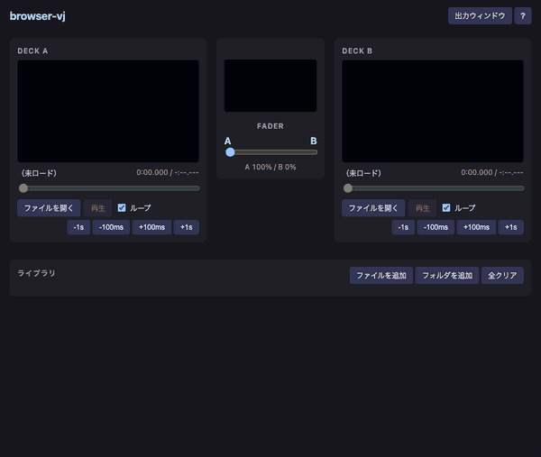

# browser-vj

ブラウザ上で動作するシンプルな2デッキVJツール。本体はインストール不要・ランタイム依存ゼロで、ローカルのmp4をロードしてクロスフェードできる（任意機能のスマホリモコンのみNode製の中継サーバを使う）。



## 特徴

- **2デッキ + クロスフェーダー** — A/Bにmp4（H.264）をロードしてフェーダーでミックス
- **出力ウィンドウ + 埋め込みプレビュー** — 合成結果を別ウィンドウ（プロジェクタ用、ダブルクリックで最大化）に表示。コントローラ内にも同じ合成結果のプレビューを常時表示
- **手動リップシンク** — 各デッキの再生位置を±100ms / ±1sで微調整（ホットキー対応）
- **ライブラリ** — よく使う動画をサムネイル付きで登録してワンクリックでデッキへ。フォルダまとめ登録・ドラッグ＆ドロップ対応。フォルダ＋ファイル名のパス順で自動整列
- **スマホでリモコン** — 同一LAN上のスマホから再生・フェーダー・ナッジ・ライブラリ選択を操作。外部ディスプレイ無しでPCを全画面出力にしたまま手元で操作できる。出力中デッキの表示・各デッキの再生位置バー付き。ヘルプ画面のQRで接続
- **GPU任せの軽さ** — デコードはハードウェア、合成はGPUコンポジタ。JS側にフレーム処理なし

## 動作環境

- ブラウザ: **Chrome等のChromium系を推奨**。フォルダのドラッグ＆ドロップに対応する。ライブラリはセッション中のみ有効（ブラウザを閉じると消える）
- 開発・ビルド: Node.js 20.19以降または22.12以降（Vite 8の要件）

## 起動

```sh
npm install
npm run dev      # 開発サーバ（http://localhost:5173）
npm run build    # 型チェック + dist/ へビルド
npm run preview  # ビルド結果の確認
npm test         # ヘッドレス Chrome での E2E スモークテスト（test/ 参照）
```

ビルド成果物は静的ファイルのみなので、任意の静的ホスティングで配信できる（同一オリジンで `index.html` と `output.html` を配信すること）。

### GitHub Pages で公開する

`main` ブランチへの push で [.github/workflows/deploy.yml](.github/workflows/deploy.yml) が自動ビルド・デプロイする。リポジトリの **Settings → Pages → Build and deployment → Source** を「**GitHub Actions**」に設定すれば有効になる。

サブパス（`https://<user>.github.io/<repo>/`）配信のための `base` は、CI 上で `GITHUB_REPOSITORY` から自動的に決まる（[vite.config.ts](vite.config.ts)）。ローカルの `npm run dev` / `npm run preview` では `/` のまま動く。

## 使い方

1. 各デッキの「ファイルを開く」またはデッキパネルへのドラッグ＆ドロップでmp4（H.264）をロード（ロードと同時に再生開始）
2. 「出力ウィンドウ」を開き、プロジェクタ等の画面へ移動してダブルクリックで最大化（ウィンドウをディスプレイいっぱいに広げる）
3. フェーダーでA/Bをクロスフェード（合成結果はフェーダー上の埋め込みプレビューで常時確認できる）
4. よく使う動画は「ファイルを追加 / フォルダを追加」またはライブラリ欄へのドラッグ＆ドロップ（フォルダごとでもOK）で登録し、「→ A / → B」でロード。ライブラリはフォルダ＋ファイル名のパス順で自動的に並ぶ。「全クリア」でライブラリを空にできる（macOSの `._` メタデータファイルは自動で除外される）。ライブラリはそのセッション中のみ有効（ブラウザを閉じると消える）

デッキエリアは画面上部に固定表示されるので、ライブラリを下にスクロールしながらでもA/Bの映像を確認できる。

## スマホでリモコン

外部ディスプレイが無く、PCの画面を全画面出力にしたまま手元で操作したいとき向けの機能。PCとスマホを同一LANに繋いで使う（認証なし・同一LAN前提の簡易構成）。

```sh
node bridge/server.mjs   # 中継サーバを起動（既定ポート 8787、PORT で変更可）
```

1. 上記サーバを起動した状態で、コントローラのヘルプ（「？」ボタン）を開く
2. 「スマホでリモコン」欄のQRをスマホで読み取る（同じWi-Fiに繋いでおく）
3. スマホのリモコン画面で再生/停止・フェーダー・ナッジ・ライブラリからのロードができる

リモコンには出力中（フェーダーで選ばれている側）のデッキが大きく表示され、各デッキの再生位置が再生ボタンのバーで分かる。動画ファイル自体はPC側に置いたままで、スマホへは送らない（操作の指示だけが流れる）。

## ホットキー

| キー | 動作 |
| --- | --- |
| ← / → | フェーダー移動（5%、Shiftで1%） |
| 1 / 2 | フェーダーをA / Bへ一気に切り替え |
| S | Deck A 再生/停止 |
| L | Deck B 再生/停止 |
| Q / W | Deck A 再生位置 -100ms / +100ms（Shiftで±1s） |
| O / P | Deck B 再生位置 -100ms / +100ms（Shiftで±1s） |

各デッキの ±100ms / ±1s ナッジボタンでも同じ調整ができる。ホットキーは出力ウィンドウにフォーカスがあるときも有効。

## 既知の制限

- デッキ動画は音声を載せて再生する（全画面時の省電力停止対策、[ADR-0011](docs/adr/0011-keep-deck-videos-audible-to-avoid-background-freeze.md)）。映像用途では出力スピーカーをOS側でミュートする運用を想定。曲は別系統で再生する前提
- 動画は再生終了後デフォルトでループする（各デッキの「ループ」チェックでオフにでき、その場合は最終フレームで停止する）
- ミックスはアルファブレンドのクロスフェードのみ（ルマキー等のエフェクトは未対応）
- ウィンドウ間の映像同期はフレーム単位の保証はなく、±20ms程度のずれが残りうる
- ライブラリ登録したファイルを移動・削除するとロードに失敗する（ファイルはコピーせず参照のみ保持するため）

## 仕組み

- コントローラ（[index.html](index.html) + [src/main.ts](src/main.ts)）がデッキ操作・フェーダー・ライブラリ・ホットキーを担当
- 出力ウィンドウ（[output.html](output.html) + [src/output.ts](src/output.ts)）は `<video>` 2枚をCSS opacityで重ねた合成結果を表示（レターボックス部は黒で塗り、アスペクト比が異なる動画でも下のデッキが透けないようにしている）。コントローラ内の埋め込みプレビューも同じ重ね方で、デッキ動画に直接追従させている
- ウィンドウ間は BroadcastChannel（[src/protocol.ts](src/protocol.ts)）で同期。コントローラが再生位置を配信し、ミラー側は再生速度の微調整で滑らかに追従する
- ライブラリ（[src/library.ts](src/library.ts)）は登録された動画をメモリ上で保持する（セッション内のみ）
- スマホリモコンは中継サーバ（[bridge/server.mjs](bridge/server.mjs)）を介す。スマホの操作UI（[bridge/remote.html](bridge/remote.html)）とコントローラがWebSocketで繋がり、サーバは受け取ったメッセージを他クライアントへ素通しするだけのハブ。コントローラはWSで届いた操作を既存のホットキー処理に流し、現在状態（出力中デッキ・再生位置）とライブラリ一覧をスマホへ返す

設計の経緯・選択肢の比較は Architecture Decision Record（[docs/adr/](docs/adr/)）に記録している。

機能要件は [REQUIREMENT.md](REQUIREMENT.md) を参照。

## 開発について

本プロジェクトの設計・実装・テストは [Claude Code](https://claude.com/claude-code)（Anthropic）で行った。要件定義（[REQUIREMENT.md](REQUIREMENT.md)）と動作確認は人間による。

## ライセンス

[MIT](LICENSE)
