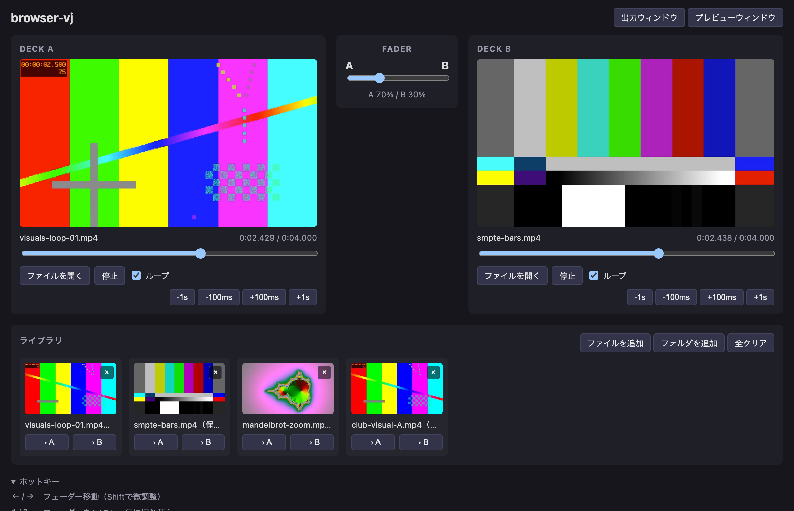

# browser-vj

ブラウザ上で動作するシンプルな2デッキVJツール。インストール不要・依存ゼロ（ランタイム）で、ローカルのmp4をロードしてクロスフェードできる。



## 特徴

- **2デッキ + クロスフェーダー** — A/Bにmp4（H.264）をロードしてフェーダーでミックス
- **出力 / プレビューウィンドウ** — コントローラとは別ウィンドウに合成結果を表示。プロジェクタへ移してダブルクリックで最大化
- **手動リップシンク** — 各デッキの再生位置を±100ms / ±1sで微調整（ホットキー対応）
- **ライブラリ** — よく使う動画をサムネイル付きで登録してワンクリックでデッキへ。フォルダまとめ登録・ドラッグ＆ドロップ対応。フォルダ＋ファイル名のパス順で自動整列
- **GPU任せの軽さ** — デコードはハードウェア、合成はGPUコンポジタ。JS側にフレーム処理なし

## 動作環境

- ブラウザ: **Chrome等のChromium系を推奨**。フォルダのドラッグ＆ドロップに対応する。ライブラリはセッション中のみ有効（ブラウザを閉じると消える）
- 開発・ビルド: Node.js 20.19以降または22.12以降（Vite 8の要件）

## 起動

```sh
npm install
npm run dev      # 開発サーバ（http://localhost:5173）
npm run build    # 型チェック + dist/ へビルド
npm run preview  # ビルド結果の確認
npm test         # ヘッドレス Chrome での E2E スモークテスト（test/ 参照）
```

ビルド成果物は静的ファイルのみなので、任意の静的ホスティングで配信できる（同一オリジンで `index.html` と `output.html` を配信すること）。

### GitHub Pages で公開する

`main` ブランチへの push で [.github/workflows/deploy.yml](.github/workflows/deploy.yml) が自動ビルド・デプロイする。リポジトリの **Settings → Pages → Build and deployment → Source** を「**GitHub Actions**」に設定すれば有効になる。

サブパス（`https://<user>.github.io/<repo>/`）配信のための `base` は、CI 上で `GITHUB_REPOSITORY` から自動的に決まる（[vite.config.ts](vite.config.ts)）。ローカルの `npm run dev` / `npm run preview` では `/` のまま動く。

## 使い方

1. 各デッキの「ファイルを開く」またはデッキパネルへのドラッグ＆ドロップでmp4（H.264）をロード（ロードと同時に再生開始）
2. 「出力ウィンドウ」を開き、プロジェクタ等の画面へ移動してダブルクリックで最大化（ウィンドウをディスプレイいっぱいに広げる）
3. フェーダーでA/Bをクロスフェード
4. よく使う動画は「ファイルを追加 / フォルダを追加」またはライブラリ欄へのドラッグ＆ドロップ（フォルダごとでもOK）で登録し、「→ A / → B」でロード。ライブラリはフォルダ＋ファイル名のパス順で自動的に並ぶ。「全クリア」でライブラリを空にできる（macOSの `._` メタデータファイルは自動で除外される）。ライブラリはそのセッション中のみ有効（ブラウザを閉じると消える）

デッキエリアは画面上部に固定表示されるので、ライブラリを下にスクロールしながらでもA/Bの映像を確認できる。

## ホットキー

| キー | 動作 |
| --- | --- |
| ← / → | フェーダー移動（5%、Shiftで1%） |
| 1 / 2 | フェーダーをA / Bへ一気に切り替え |
| S | Deck A 再生/停止 |
| L | Deck B 再生/停止 |
| Q / W | Deck A 再生位置 -100ms / +100ms（Shiftで±1s） |
| O / P | Deck B 再生位置 -100ms / +100ms（Shiftで±1s） |

各デッキの ±100ms / ±1s ナッジボタンでも同じ調整ができる。ホットキーは出力/プレビューウィンドウにフォーカスがあるときも有効。

## 既知の制限

- 音声は出力しない（全デッキミュート）。曲は別系統で再生する前提
- 動画は再生終了後デフォルトでループする（各デッキの「ループ」チェックでオフにでき、その場合は最終フレームで停止する）
- ミックスはアルファブレンドのクロスフェードのみ（ルマキー等のエフェクトは未対応）
- ウィンドウ間の映像同期はフレーム単位の保証はなく、±20ms程度のずれが残りうる
- ライブラリ登録したファイルを移動・削除するとロードに失敗する（ファイルはコピーせず参照のみ保持するため）

## 仕組み

- コントローラ（[index.html](index.html) + [src/main.ts](src/main.ts)）がデッキ操作・フェーダー・ライブラリ・ホットキーを担当
- 出力/プレビューウィンドウ（[output.html](output.html) + [src/output.ts](src/output.ts)）は `<video>` 2枚をCSS opacityで重ねた合成結果を表示（レターボックス部は黒で塗り、アスペクト比が異なる動画でも下のデッキが透けないようにしている）
- ウィンドウ間は BroadcastChannel（[src/protocol.ts](src/protocol.ts)）で同期。コントローラが再生位置を配信し、ミラー側は再生速度の微調整で滑らかに追従する
- ライブラリ（[src/library.ts](src/library.ts)）は登録された動画をメモリ上で保持する（セッション内のみ）

設計の経緯・選択肢の比較は Architecture Decision Record に記録している:

- [ADR-0001: 言語とビルドツールの選定](docs/adr/0001-language-and-build-tooling.md)
- [ADR-0002: 映像のレンダリングと合成方式](docs/adr/0002-video-rendering-and-blending.md)
- [ADR-0003: 出力ウィンドウとの同期方式](docs/adr/0003-multi-window-sync.md)
- [ADR-0004: ライブラリの永続化方式](docs/adr/0004-library-persistence.md)（廃止 → ADR-0010）
- [ADR-0005: バックグラウンド省電力による強制停止への対策](docs/adr/0005-background-throttling-resilience.md)（廃止 → ADR-0009 で前提が解消）
- [ADR-0006: GitHub Pages へのデプロイと base パス戦略](docs/adr/0006-github-pages-deployment.md)
- [ADR-0007: テスト方針（実ブラウザ E2E スモークテスト）](docs/adr/0007-e2e-smoke-testing.md)
- [ADR-0008: ファイル選択に File System Access API を使わない](docs/adr/0008-file-picker-vs-fullscreen.md)
- [ADR-0009: 出力ウィンドウを最大化で全画面表示する](docs/adr/0009-output-window-maximize-instead-of-fullscreen.md)
- [ADR-0010: ライブラリの永続化を廃止しメモリ保持に統一する](docs/adr/0010-drop-library-persistence.md)

機能要件は [REQUIREMENT.md](REQUIREMENT.md) を参照。

## TODO

- ルマキー等のミックスエフェクト（WebGL移行が必要、ADR-0002参照）
- 再生速度（ピッチ）調整によるBPM同期

## 開発について

本プロジェクトの設計・実装・テストは [Claude Code](https://claude.com/claude-code)（Anthropic）で行った。要件定義（[REQUIREMENT.md](REQUIREMENT.md)）と動作確認は人間による。

## ライセンス

[MIT](LICENSE)
